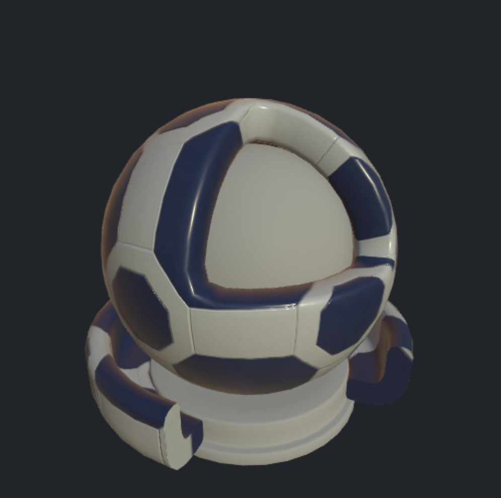
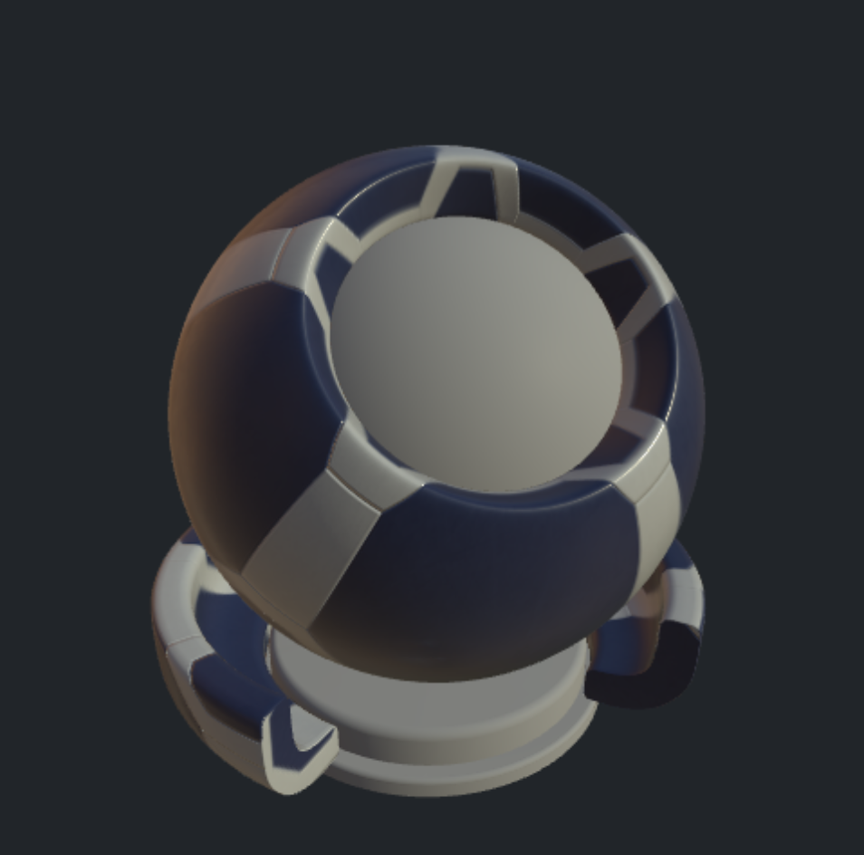

## USD StandardShaderBall Conversion Utility

This repo contains two scripts to allow:

1. Cloning the current USD Standard Shader Ball scene only.
2. Converting the scene used Blender (bpy) to output a glTF (GLB) file.

### 1. Steps

1. Use `usdball_download.sh` to clone only the shader ball scene into a new repo folder called `StandardShaderBall`.
2. Use `togltf.py` from the root of that repo to create the GLB file called: `standard_shader_ball_scene.glb`. Use the `--smooth` option if additional smoothing is desired for the surface material geometry.

The non shader ball geometry, cameras, and lights are all stripped away. As well no materials are saved.

A Python virtual environment can also be used.
- On non-windows: `bpy_env.sh` sets up a virtual environment and installs `bpy`.
- On Windoows: `bpy_env_win.bat` sets up a virtual environment and installs `bpy`.

#### 1.1 Example

The geometry with just the script conversion is shown below:

| MaterialX Web Viewer (drag geometry into viewer) | Blender |
| :--: | :--: |
|  |   |

### 2. Using MaterialX Looks

The geometry in the glTF file can be assigned so that the main material to "preview" can be assigned to the outer shell and ring around the base. The rest can be assigned some "default" material. You can also assign to the "Arnold"shader ball using the same material assignments.

Below is an example look with "base,"core","sss_bars" and "material_surface" the names of geometry in the USD shader ball,
and "Calibration_Mesh" and "Preview_Mesh" the names of geometry in the Arnold shader ball: 

```xml
<look name="look1">
<materialassign name="default" geom="base,core,sss_bars,Calibration_Mesh" material="MY_DEFAULT_MATERIAL" />
 <materialassign name="preview" geom="material_surface,Preview_Mesh" material="MY_PREVIEW_MATERIAL" />
</look>
```

with an example default OpenPBR material:

```xml
<?xml version="1.0"?>
<materialx version="1.39" colorspace="lin_rec709">
  <surfacematerial name="MY_DEFAULT_MATERIAL" type="material">
    <input name="surfaceshader" type="surfaceshader" nodename="open_pbr_surface_surfaceshader" />
  </surfacematerial>
  <open_pbr_surface name="open_pbr_surface_surfaceshader" type="surfaceshader">
    <input name="base_weight" type="float" value="1.0" />
    <input name="base_color" type="color3" value="0.3, 0.3, 0.3" />
    <input name="base_diffuse_roughness" type="float" value="0.2" />
    <input name="base_metalness" type="float" value="0.0" />
    <input name="specular_weight" type="float" value="0.1" />
    <input name="specular_color" type="color3" value="1, 1, 1" />
    <input name="specular_roughness" type="float" value="0.5" />
    <input name="specular_ior" type="float" value="1.5" />
  </open_pbr_surface>
</materialx>
```
#### 2.1 UsdPreviewSurface Materials

The `togltf` script does not currently extract out the `USDPreviewSurface` materials from the USD asset to avoid having to build or install a USD release.  

#### 2.2 MaterialX Look Assignments

The remaining USD asset examples can be extracted and have looks added to it using the `addLook.py` script. 

The script can also perform rendering as specified by a user defined render string argument such that:
- `%g` is replaced by the geometry file name
- `%m` is replaced by the Materialx file name
- `%o` is replaced by the output image name
- `%p` is replaced by the path to the source content to aid in resolving image references.

#### 2.3 USD Asset Examples

Below is an example which iterates over all MaterialX documents in the USD asset and creates new documents with the appropriate looks which are then rendered using a release version of `MaterialXView`.

```shell
addlook.py ./StandardShaderBall/full_assets/StandardShaderBall/example_materials -r "MaterialXView --material %m --mesh %g --screenWidth 480 --screenHeight 480 --captureFilename %o  --cameraPosition 7.5,17.0,17.0 --cameraZoom 6 --shadowMap true --lightRotation 20 --screenColor 0.6,0.6,0.6" --g ./standard_shader_ball_scene_smooth.glb -o example_materials
```
Results of executing this script are shown below:

| Material | Standard Surface | OpenPBR | 
| :--: | :--: | :--: |
| Surface Plastic |  |  | 
| Surface Bubblegum |  |   |
| Glass |  |   |
| Gold |  |    |

#### 2.4 Rendering MaterialX Examples

The `glTF`, `OpenPBR` and `Autodesk Standard Surface` release sample materials have been rendered using this script. The resulting 
MaterialX documents and rendered images can be found in the `*_1.39.5` subfolders in the repository:

- [OpenPBR Gallery](docs/OpenPbr_1.39.5_gallery.md) 
- [Standard Surface Gallery](docs/StandardSurface_1.39.5_gallery.md)
- [glTF Gallery](docs/GltfPbr_1.39.5_gallery.md)
- [UsdPreview Gallery](docs/UsdPreviewSurface_1.39.5_gallery.md)
- [Disney Principled Gallery](DisneyPrincipled_1.39.5_gallery.md))


#### 2.5 Rendering General Material Assets

The script is generic enough to add looks and render arbitrary MaterialX documents containing materials.

Below is an example using a material from `PolyHaven` using the same MaterialX document but applied to different shader ball geometry.

| USD Shader Ball | Arnold Shader Ball |
| :--: | :--: |
|  |  |

---


